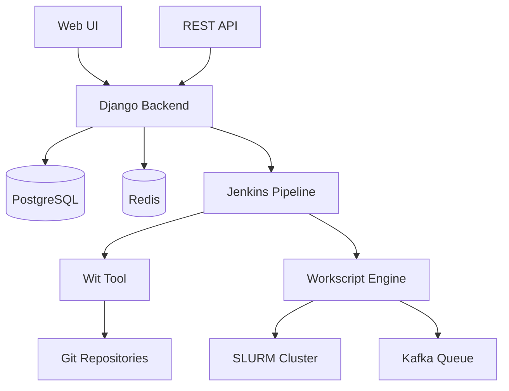
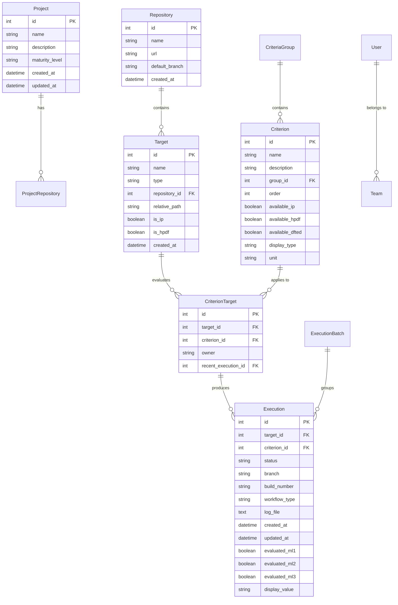
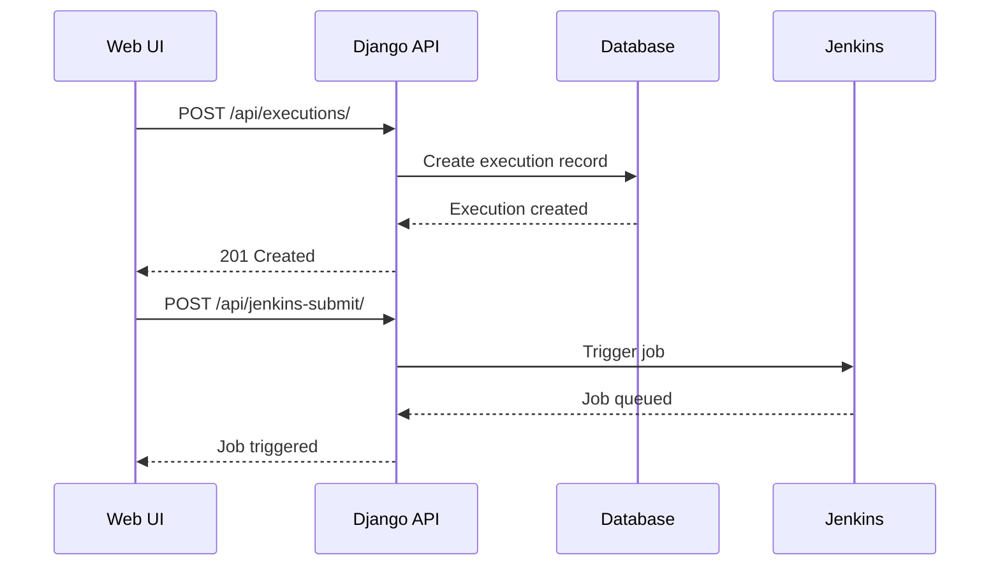
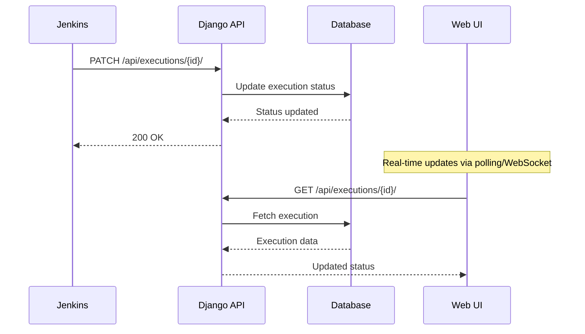
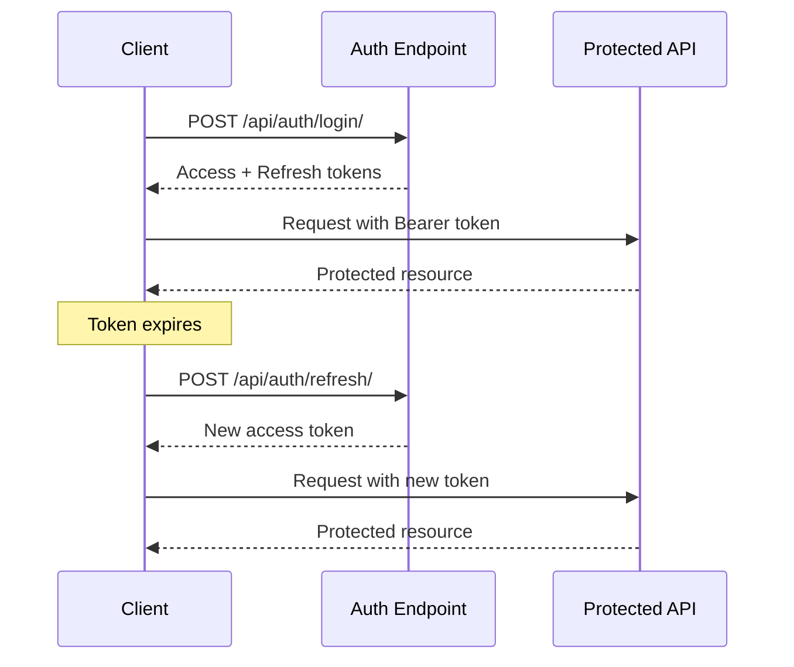
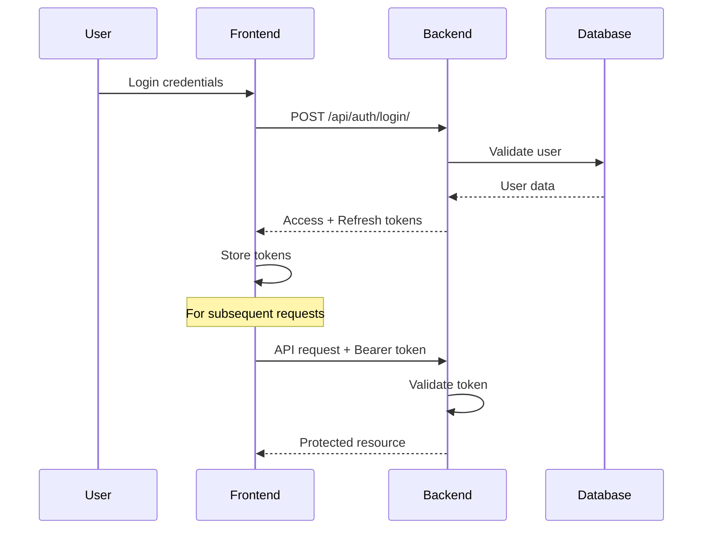
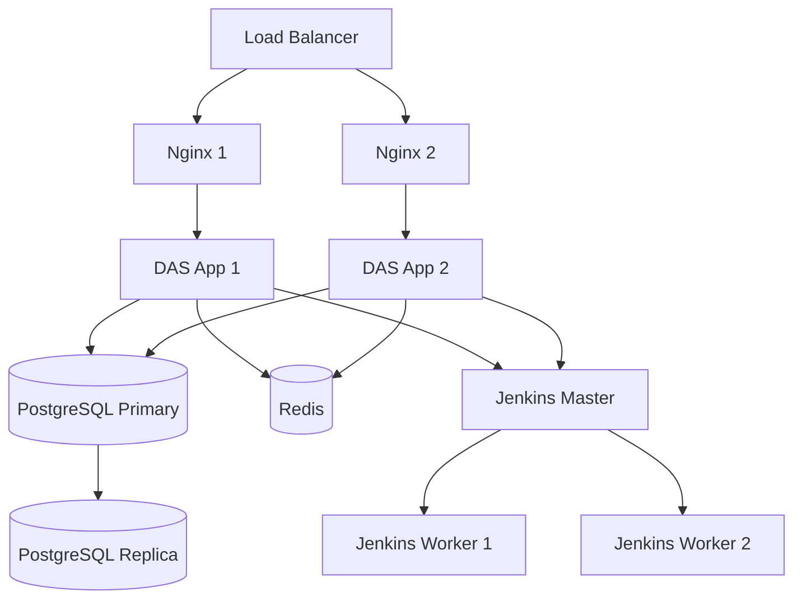

# Architecture Documentation

This document provides a detailed overview of the Design Automation System (DAS) architecture, including system components, data flow, and integration patterns.

## Table of Contents

- [System Overview](#system-overview)
- [Component Architecture](#component-architecture)
- [Data Models](#data-models)
- [API Architecture](#api-architecture)
- [Frontend Architecture](#frontend-architecture)
- [Integration Patterns](#integration-patterns)
- [Security Architecture](#security-architecture)
- [Deployment Architecture](#deployment-architecture)

## System Overview

DAS is designed as a distributed system for semiconductor design verification workflows, consisting of multiple interconnected components that work together to provide automated testing, monitoring, and reporting capabilities.

### High-Level Architecture



### Core Principles

1. **Separation of Concerns**: Each component has a specific responsibility
2. **Scalability**: Horizontal scaling through distributed execution
3. **Reliability**: Fault tolerance and graceful degradation
4. **Security**: Authentication, authorization, and data protection
5. **Maintainability**: Modular design with clear interfaces

## Component Architecture

### Django Backend (This Repository)

The central hub that manages data, provides APIs, and serves the web interface.

#### Application Structure

```
webserver/
├── server/              # Django project configuration
├── accounts/            # User management and authentication
├── modeling/           # Core business logic and data models
├── fronts/             # Web interface and presentation layer
├── configs/            # Configuration management
└── statics/            # Static assets (CSS, JS, images)
```

#### Component Responsibilities

| Component | Responsibility | Key Features |
|-----------|---------------|--------------|
| **accounts/** | User management | JWT auth, teams, permissions |
| **modeling/** | Domain logic | Projects, targets, criteria, executions |
| **fronts/** | Web interface | Templates, static assets, views |
| **server/** | Configuration | Settings, URLs, ASGI/WSGI |

### External Components

#### Jenkins Pipeline
- **Purpose**: Workflow orchestration and CI/CD
- **Language**: Groovy (Jenkinsfile)
- **Integration**: REST API calls to DAS backend
- **Responsibilities**: 
  - Execute test workflows
  - Coordinate with wit and workscript
  - Report execution status back to DAS

#### Wit Tool
- **Purpose**: Multi-repository workspace management
- **Language**: Python
- **Integration**: Command-line interface
- **Responsibilities**:
  - Resolve repository dependencies
  - Create unified workspaces
  - Generate environment modules

#### Workscript Engine
- **Purpose**: DAG execution with distributed processing
- **Language**: Python
- **Integration**: Command-line interface and Kafka
- **Responsibilities**:
  - Execute workflow DAGs
  - Manage SLURM job submission
  - Handle distributed processing via Kafka

## Data Models

### Entity Relationship Diagram



### Data Flow Patterns

#### Execution Creation Flow



#### Status Update Flow



## API Architecture

### RESTful Design

The API follows REST principles with resource-based URLs and standard HTTP methods:

```
GET    /api/projects/           # List projects
POST   /api/projects/           # Create project
GET    /api/projects/{id}/      # Get specific project
PATCH  /api/projects/{id}/      # Update project
DELETE /api/projects/{id}/      # Delete project
```

### Authentication Flow



### Error Handling Pattern

```python
{
    "detail": "Error description",
    "code": "error_code",
    "field_errors": {
        "field_name": ["Field-specific error messages"]
    }
}
```

### Pagination Structure

```python
{
    "count": 100,
    "next": "http://api/endpoint/?page=3",
    "previous": "http://api/endpoint/?page=1", 
    "results": [
        // ... actual data
    ]
}
```

## Frontend Architecture

### Template Hierarchy

```
templates/
├── layouts/
│   └── base.html              # Base template with common structure
├── components/
│   ├── navbar.html           # Navigation component
│   ├── project-card.html     # Project display cards
│   └── execution_table.html  # Execution matrix table
└── pages/
    ├── index.html            # Dashboard
    └── project/
        └── detail.html       # Project detail with execution matrix
```

### Static Asset Organization

```
static/
├── css/
│   ├── common.css            # Global styles
│   ├── design-system/        # Design tokens and variables
│   ├── components/           # Component-specific styles
│   └── page/                 # Page-specific styles
├── js/
│   ├── components/           # JavaScript components
│   └── page/                 # Page-specific JavaScript
└── img/                      # Images and icons
```

### JavaScript Architecture

#### Component Pattern

```javascript
class ExecutionDetailModal {
    constructor(modalId, apiClient) {
        this.modal = document.getElementById(modalId);
        this.apiClient = apiClient;
        this.init();
    }

    init() {
        this.bindEvents();
    }

    bindEvents() {
        // Event binding logic
    }

    async show(executionId) {
        const data = await this.apiClient.getExecutionDetail(executionId);
        this.render(data);
        this.modal.show();
    }

    render(data) {
        // Rendering logic
    }
}
```

#### State Management Pattern

```javascript
class ProjectDetailState {
    constructor() {
        this.state = {
            selectedTargets: new Set(),
            selectedCriteria: new Set(),
            filters: {
                type: 'all',
                branch: '',
                dateFrom: null,
                dateTo: null
            }
        };
        this.listeners = new Set();
    }

    setState(newState) {
        this.state = { ...this.state, ...newState };
        this.notifyListeners();
    }

    subscribe(listener) {
        this.listeners.add(listener);
    }

    notifyListeners() {
        this.listeners.forEach(listener => listener(this.state));
    }
}
```

## Integration Patterns

### Jenkins Integration

#### Job Triggering Pattern

```python
class JenkinsIntegration:
    def __init__(self, base_url, username, token):
        self.base_url = base_url
        self.auth = (username, token)
    
    def trigger_job(self, job_path, parameters=None):
        """Trigger Jenkins job with parameters"""
        url = f"{self.base_url}/{job_path}/buildWithParameters"
        response = requests.post(
            url,
            data=parameters or {},
            auth=self.auth,
            timeout=30
        )
        return response
    
    def get_build_info(self, job_path, build_number):
        """Get information about a specific build"""
        url = f"{self.base_url}/{job_path}/{build_number}/api/json"
        response = requests.get(url, auth=self.auth, timeout=30)
        return response.json()
```

#### Callback Pattern

```python
class JenkinsCallbackView(APIView):
    authentication_classes = [JWTAuthentication]
    permission_classes = [IsAuthenticated]
    
    def post(self, request):
        """Handle callbacks from Jenkins"""
        build_data = request.data
        execution_id = build_data.get('execution_id')
        status = build_data.get('status')
        
        try:
            execution = Execution.objects.get(id=execution_id)
            execution.status = status
            execution.save()
            
            return Response({'status': 'updated'})
        except Execution.DoesNotExist:
            return Response(
                {'error': 'Execution not found'}, 
                status=404
            )
```

### Git Integration

#### Repository Management

```python
class GitRepositoryManager:
    def __init__(self, repository):
        self.repository = repository
        self.git_url = repository.url
    
    def get_branches(self):
        """List all branches in repository"""
        result = subprocess.run([
            'git', 'ls-remote', '--heads', self.git_url
        ], capture_output=True, text=True)
        
        branches = []
        for line in result.stdout.split('\n'):
            if line:
                ref = line.split('\t')[1]
                branch_name = ref.split('/')[-1]
                branches.append(branch_name)
        
        return branches
    
    def get_latest_commit(self, branch='main'):
        """Get latest commit hash for branch"""
        result = subprocess.run([
            'git', 'ls-remote', self.git_url, f'refs/heads/{branch}'
        ], capture_output=True, text=True)
        
        if result.stdout:
            return result.stdout.split('\t')[0]
        return None
```

## Security Architecture

### Authentication & Authorization

#### JWT Token Flow



#### Permission System

```python
class ExecutionPermission(BasePermission):
    def has_permission(self, request, view):
        return request.user.is_authenticated
    
    def has_object_permission(self, request, view, obj):
        # Users can view executions for their projects
        if request.method in permissions.SAFE_METHODS:
            return True
        
        # Only owners/admins can modify executions
        return (
            request.user.is_staff or 
            obj.criterion_target.owner == request.user.email
        )
```

### Data Protection

#### Sensitive Data Handling

```python
class ExecutionSerializer(serializers.ModelSerializer):
    log_content = serializers.SerializerMethodField()
    
    def get_log_content(self, obj):
        # Sanitize log content before sending to client
        if obj.log_file and os.path.exists(obj.log_file):
            with open(obj.log_file, 'r') as f:
                content = f.read()
                # Remove sensitive information
                content = re.sub(r'password=\S+', 'password=***', content)
                content = re.sub(r'token=\S+', 'token=***', content)
                return content
        return None
```

### Input Validation

```python
class ExecutionCreateSerializer(serializers.ModelSerializer):
    class Meta:
        model = Execution
        fields = ['target', 'criterion', 'branch', 'build_number']
    
    def validate_branch(self, value):
        # Validate branch name format
        if not re.match(r'^[a-zA-Z0-9/_-]+$', value):
            raise serializers.ValidationError(
                "Branch name contains invalid characters"
            )
        return value
    
    def validate(self, attrs):
        # Validate target-criterion compatibility
        target = attrs['target']
        criterion = attrs['criterion']
        
        if not self._is_compatible(target, criterion):
            raise serializers.ValidationError(
                "Target and criterion are not compatible"
            )
        
        return attrs
```

## Deployment Architecture

### Production Deployment



### Container Architecture (Optional)

```dockerfile
# Multi-stage build for optimized production image
FROM python:3.11-slim as builder
WORKDIR /app
COPY requirements.txt .
RUN pip install --user -r requirements.txt

FROM python:3.11-slim
WORKDIR /app
COPY --from=builder /root/.local /root/.local
COPY . .

# Security: Run as non-root user
RUN adduser --disabled-password --gecos '' appuser
USER appuser

EXPOSE 8000
CMD ["gunicorn", "--config", "gunicorn.conf.py", "server.asgi:application"]
```

### Kubernetes Deployment (Optional)

```yaml
apiVersion: apps/v1
kind: Deployment
metadata:
  name: das-backend
spec:
  replicas: 3
  selector:
    matchLabels:
      app: das-backend
  template:
    metadata:
      labels:
        app: das-backend
    spec:
      containers:
      - name: das-backend
        image: das:latest
        ports:
        - containerPort: 8000
        env:
        - name: DATABASE_URL
          valueFrom:
            secretKeyRef:
              name: das-secrets
              key: database-url
        - name: DJANGO_SECRET_KEY
          valueFrom:
            secretKeyRef:
              name: das-secrets
              key: secret-key
        livenessProbe:
          httpGet:
            path: /health/
            port: 8000
          initialDelaySeconds: 30
          periodSeconds: 10
        readinessProbe:
          httpGet:
            path: /health/
            port: 8000
          initialDelaySeconds: 5
          periodSeconds: 5
```

## Performance Considerations

### Database Optimization

#### Query Optimization Patterns

```python
# Use select_related for foreign keys
executions = Execution.objects.select_related(
    'target', 'criterion', 'target__repository'
).filter(status='RUNNING')

# Use prefetch_related for reverse foreign keys
projects = Project.objects.prefetch_related(
    'repositories__targets__criterion_targets__recent_execution'
)

# Use database functions for aggregation
from django.db.models import Count, Avg, Max
stats = Execution.objects.aggregate(
    total=Count('id'),
    avg_duration=Avg('duration'),
    latest=Max('created_at')
)
```

#### Custom Indexes

```python
# modeling/indexes.py
from django.db import models

class CustomIndexes:
    execution_indexes = [
        models.Index(
            fields=['status', 'created_at'],
            name='exec_status_created_idx'
        ),
        models.Index(
            fields=['target', 'criterion', 'branch'],
            name='exec_target_criterion_branch_idx'
        ),
    ]
```

### Caching Strategy

#### Multi-Level Caching

```python
from django.core.cache import cache
from django.views.decorators.cache import cache_page

# View-level caching
@cache_page(60 * 15)  # Cache for 15 minutes
def project_list(request):
    return render(request, 'projects/list.html', context)

# Query-level caching
def get_project_stats(project_id):
    cache_key = f"project_stats_{project_id}"
    stats = cache.get(cache_key)
    
    if stats is None:
        stats = calculate_project_stats(project_id)
        cache.set(cache_key, stats, 60 * 30)  # Cache for 30 minutes
    
    return stats
```

### Async Processing

#### Task Queue Pattern

```python
from celery import Celery

app = Celery('das')

@app.task
def process_execution_results(execution_id):
    """Process execution results asynchronously"""
    execution = Execution.objects.get(id=execution_id)
    
    # Parse log files
    results = parse_execution_logs(execution.log_file)
    
    # Update evaluation status
    update_evaluation_status(execution, results)
    
    # Send notifications
    send_completion_notification(execution)
```

This architecture documentation provides a comprehensive overview of the DAS system design, enabling developers to understand the system structure and make informed decisions about modifications and extensions.